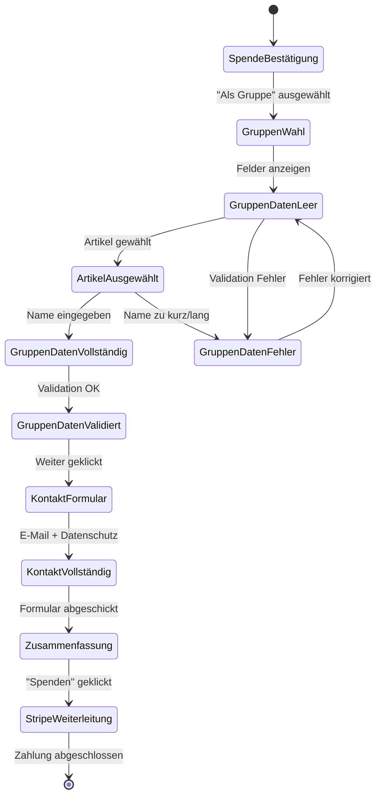

# User Journey: Gruppenspende-Flow

## Detaillierter Flow für Gruppenspenden

### Übersicht der neuen User Journey

```mermaid
graph TD
    Start([User besucht Website]) --> Index[Index-Seite]
    Index --> VersWahl[Vers-Auswahl]
    VersWahl --> VersBestaetigung[Vers-Bestätigung]
    
    %% Erweiterte Spende-Art-Auswahl
    VersBestaetigung --> SpendeArt{Spende-Art wählen}
    
    %% Drei Pfade
    SpendeArt -->|Einzelperson| Datenerfassung[Standard<br/>Datenerfassung]
    SpendeArt -->|Gruppe| GruppenDaten[Gruppendaten<br/>erfassen]
    SpendeArt -->|Geschenk| GeschenkDaten[Geschenkdaten<br/>erfassen]
    
    %% Gruppenspende-Flow (NEU)
    GruppenDaten --> ArtikelWahl[Artikel auswählen<br/>Der/Die/Das]
    ArtikelWahl --> GruppenName[Gruppenname<br/>eingeben<br/>2-80 Zeichen]
    GruppenName --> GruppenValidierung{Eingabe<br/>gültig?}
    
    GruppenValidierung -->|Nein| GruppenFehler[Fehlermeldung<br/>anzeigen]
    GruppenFehler --> ArtikelWahl
    
    GruppenValidierung -->|Ja| GruppenInfo[Info-Boxen<br/>• Kontaktperson<br/>• Keine auto. Spendenbeschein.]
    GruppenInfo --> KontaktDaten[Kontaktperson-<br/>Daten erfassen]
    
    %% Kontaktdaten für Gruppenspenden
    KontaktDaten --> KontaktEmail[E-Mail-Adresse<br/>(für Zertifikat)]
    KontaktEmail --> KontaktNewsletter{Newsletter<br/>abonnieren?}
    KontaktNewsletter --> KontaktDatenschutz[Datenschutz-<br/>Einwilligung]
    
    %% Besonderheit: Keine automatische Spendenbescheinigung
    KontaktDatenschutz --> GruppenZusammenfassung[Zusammenfassung<br/>mit Gruppenhinweis]
    
    %% Standard-Flows zusammenführen
    Datenerfassung --> StandardZusammenfassung[Standard<br/>Zusammenfassung]
    GeschenkDaten --> StandardZusammenfassung
    
    %% Zahlungsprozess
    GruppenZusammenfassung --> Stripe[Stripe Payment]
    StandardZusammenfassung --> Stripe
    
    Stripe --> Erfolgreich{Zahlung<br/>erfolgreich?}
    Erfolgreich -->|Ja| GruppenDanke[Danke-Seite<br/>für Gruppe]
    Erfolgreich -->|Nein| Fehler[Fehlerseite]
    
    %% Gruppenspezifische Danke-Seite
    GruppenDanke --> GruppenZertifikat[Gruppenzertifikat<br/>Download]
    GruppenZertifikat --> SpendenHinweis[Hinweis:<br/>Spendenbescheinigung<br/>auf Anfrage]
    
    SpendenHinweis --> Ende([Ende])
    
    %% Fehlerbehandlung
    Fehler --> WiederholenOder{Wiederholen oder<br/>anderen Vers?}
    WiederholenOder -->|Wiederholen| GruppenZusammenfassung
    WiederholenOder -->|Anderen Vers| VersWahl
```

## Spezifische Decision Points für Gruppenspenden

### 1. Spende-Art-Auswahl
**Seite:** Vers-Bestätigung  
**Entscheidung:** User wählt "Als Gruppe"  
**Auswirkung:** Zeigt Gruppendaten-Felder an  

### 2. Artikel-Auswahl
**Feld:** Dropdown mit Der/Die/Das  
**Validation:** Muss ausgewählt werden  
**Zweck:** Grammatikalisch korrekte Zertifikat-Formulierung  

### 3. Gruppenname-Eingabe  
**Validation:** 2-80 Zeichen, mindestens ein Buchstabe  
**Beispiele:** Familie Schmidt, Bibelkreis Musterhausen  
**Live-Vorschau:** "{Artikel} {Gruppenname} hat durch eine Spende..."  

### 4. Kontaktperson-Rolle
**Info:** User wird als Kontaktperson definiert  
**Empfang:** Zertifikat geht an diese E-Mail-Adresse  
**Rolle:** Stellvertretend für die Gruppe  

### 5. Spendenbescheinigung-Hinweis
**Problem:** Automatische Erstellung nicht möglich für Gruppen  
**Lösung:** Manueller Kontakt erforderlich  
**Kontakt:** spenden@peter-schoeffer-stiftung.de  

## Unterschiede zu Standard-Flow

| Aspekt | Einzelperson | Gruppe | Geschenk |
|--------|-------------|--------|----------|
| **Zusatzfelder** | Keine | Artikel + Gruppenname | Empfänger-Daten |
| **Spendenbescheinigung** | Automatisch | Manuell auf Anfrage | An Spender |
| **Zertifikat-Text** | "[Name] hat..." | "[Artikel] [Gruppe] hat..." | "[Empfänger] hat durch [Spender]..." |
| **E-Mail-Template** | Standard | Gruppen-Template | Geschenk-Template |
| **Validierung** | Standard | Artikel + Name | Empfänger-Daten |

## Formular-States und Transitions

### State Diagram für Gruppenspende



## Neue Seiten/Routes für Gruppenspenden

### 1. `/checkout/gruppendaten`
**Zweck:** Artikel und Gruppenname erfassen  
**Validation:** Live-Validation für Name-Länge  
**Preview:** Live-Vorschau des Zertifikat-Texts  

### 2. `/checkout/kontaktperson` (für Gruppen)
**Unterschied zu Standard:** Andere Labels ("Kontaktperson" statt "Ihre Daten")  
**Hinweis-Box:** Info über Spendenbescheinigung  
**Felder:** Nur E-Mail, Newsletter, Datenschutz (keine Adresse)  

### 3. `/erfolg/gruppe/{purchase_id}`
**Spezieller Danke-Text:** Gruppenname im Text  
**Download:** Gruppenzertifikat statt Standard-Zertifikat  
**Hinweis:** Spendenbescheinigung auf Anfrage  

## JavaScript-Logik für Frontend

### Conditional Field Display

```javascript
function onDonationTypeChange(selectedType) {
    // Alle conditional fields verstecken
    hideAllConditionalFields();
    
    if (selectedType === 'group') {
        showGroupFields();
        enableLivePreview();
        updateProgressStep('Gruppendaten eingeben');
        updateBreadcrumb('Vers bestätigen > Gruppendaten');
    }
}

function enableLivePreview() {
    const articleField = document.getElementById('group_article');
    const nameField = document.getElementById('group_name');
    const previewDiv = document.getElementById('certificate_preview');
    
    function updatePreview() {
        const article = articleField.value;
        const name = nameField.value;
        
        if (article && name.length >= 2) {
            previewDiv.innerHTML = `
                <strong>Zertifikat-Vorschau:</strong><br>
                "${article.charAt(0).toUpperCase() + article.slice(1)} ${name} 
                hat durch eine Spende von 100€ die Übersetzung von 
                [Vers-Referenz] ermöglicht."
            `;
            previewDiv.classList.add('valid-preview');
        } else {
            previewDiv.innerHTML = '';
            previewDiv.classList.remove('valid-preview');
        }
    }
    
    articleField.addEventListener('change', updatePreview);
    nameField.addEventListener('input', updatePreview);
}
```

## Error Handling für Gruppenspenden

### Spezifische Fehlerfälle

1. **Artikel nicht gewählt**
   - Meldung: "Bitte wählen Sie einen Artikel aus"
   - Fokus auf Artikel-Dropdown

2. **Gruppenname zu kurz**  
   - Meldung: "Der Gruppenname muss mindestens 2 Zeichen haben"
   - Character Counter: "1/80 Zeichen"

3. **Gruppenname zu lang**
   - Meldung: "Der Gruppenname darf maximal 80 Zeichen haben"  
   - Character Counter: "81/80 Zeichen" (rot)

4. **Nur Sonderzeichen im Namen**
   - Meldung: "Der Gruppenname muss mindestens einen Buchstaben enthalten"

5. **Session Timeout bei Gruppendaten**
   - Warnung: "Ihre Gruppendaten gehen verloren wenn Sie nicht weitermachen"
   - Auto-Save in localStorage implementieren

## Analytics und Tracking

### Events für Gruppenspenden

```javascript
// Google Analytics / Tracking Events
gtag('event', 'donation_type_selected', {
  event_category: 'Checkout',
  event_label: 'group',
  value: 1
});

gtag('event', 'group_data_completed', {
  event_category: 'Checkout',
  event_label: article + '_' + groupNameLength,
  value: 1
});

gtag('event', 'group_donation_completed', {
  event_category: 'Conversion',
  event_label: 'group_donation',
  value: 100
});
```

## Testing Scenarios

### Happy Path - Gruppenspende

1. ✅ Vers auswählen
2. ✅ "Als Gruppe" wählen
3. ✅ Artikel "Die" wählen  
4. ✅ Gruppenname "Familie Schmidt" eingeben
5. ✅ Live-Vorschau erscheint korrekt
6. ✅ Kontaktperson-Daten eingeben
7. ✅ Datenschutz akzeptieren
8. ✅ Zusammenfassung zeigt Gruppendaten
9. ✅ Stripe-Zahlung erfolgreich
10. ✅ Gruppenzertifikat wird generiert
11. ✅ Danke-Seite mit Gruppenhinweis

### Edge Cases

- Gruppenname mit Umlauten: "Müller-Familie" ✅
- Langer Gruppenname: "Evangelische Jugendgruppe St. Martin Musterhausen e.V." ✅  
- Artikel/Name-Kombinationen: "Das Team", "Die Gruppe", "Der Verein" ✅
- Session-Timeout während Gruppendaten-Eingabe ⚠️
- JavaScript deaktiviert → Fallback-Validierung ✅

## Performance Impact

### Zusätzliche Datenbankabfragen
- **Gruppenspenden-Filter:** +1 WHERE-Klausel pro Query
- **Zertifikat-Generierung:** +2 Felder (artikel, name)  
- **Dashboard-Anzeige:** +1 CASE-Statement für Anzeige-Namen

### Frontend-Performance
- **JavaScript:** +~2KB für Conditional Logic
- **CSS:** +~1KB für Gruppen-spezifische Styles
- **Templates:** 3 neue Partial-Templates

**Geschätzte Impact:** < 5% Performance-Overhead

## Zusammenfassung neue User Journey

Die Gruppenspende-Funktion erweitert den bestehenden User Flow um einen zusätzlichen Pfad mit:

- ✅ **3-Wege-Entscheidung:** Einzelperson/Gruppe/Geschenk  
- ✅ **Gruppendaten-Schritt:** Artikel + Name-Erfassung
- ✅ **Kontaktperson-Flow:** Angepasste Labels und Hinweise
- ✅ **Spezielle Danke-Seite:** Mit Gruppenspezifischen Inhalten
- ✅ **Manuelle Spendenbescheinigung:** Klarer Hinweis und Kontaktmöglichkeit

Die Implementierung ist **minimal invasiv** und fügt sich nahtlos in die bestehende User Journey ein.