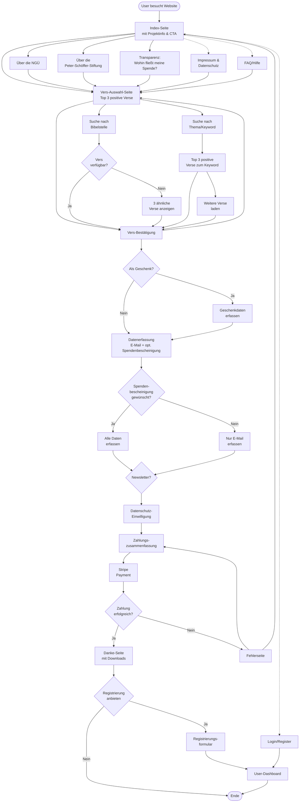

# User Journey (Flussdiagramm)

```mermaid
  graph TD
    Start([User besucht Website]) --> Index[Index-Seite<br/>mit Projektinfo & CTA]
    

    Index --> VersWahl[Vers-Auswahl-Seite<br/>Top 3 positive Verse]
    Index --> UeberNGU[Über die NGÜ]
    Index --> UeberStiftung[Über die<br/>Peter-Schöffer-Stiftung]
    Index --> Transparenz[Transparenz:<br/>Wohin fließt meine Spende?]
    
    UeberNGU --> VersWahl
    UeberStiftung --> VersWahl
    Transparenz --> VersWahl
    
    VersWahl --> VersBestaetigung[Vers-Bestätigung]
    VersWahl --> ReferenzSuche[Suche nach<br/>Bibelstelle]
    VersWahl --> KeywordSuche[Suche nach<br/>Thema/Keyword]
    
    ReferenzSuche --> VersVerfuegbar{Vers<br/>verfügbar?}
    VersVerfuegbar -->|Ja| VersBestaetigung
    VersVerfuegbar -->|Nein| AlternativVerse[3 ähnliche<br/>Verse anzeigen]
    AlternativVerse --> VersBestaetigung
    
    KeywordSuche --> Top3Keyword[Top 3 positive<br/>Verse zum Keyword]
    Top3Keyword --> VersBestaetigung
    Top3Keyword --> MehrVerse[Weitere Verse<br/>laden]
    MehrVerse --> VersBestaetigung
    
    VersBestaetigung --> Geschenk{Als Geschenk?}
    Geschenk -->|Ja| GeschenkDaten[Geschenkdaten<br/>erfassen]
    Geschenk -->|Nein| Datenerfassung
    GeschenkDaten --> Datenerfassung
    VersBestaetigung --> VersWahl
    
    Datenerfassung[Datenerfassung<br/>E-Mail + opt. Spendenbescheinigung] --> Spendenbescheinigung{Spenden-<br/>bescheinigung<br/>gewünscht?}
    
    Spendenbescheinigung -->|Ja| VolleDaten[Alle Daten<br/>erfassen]
    Spendenbescheinigung -->|Nein| NurEmail[Nur E-Mail<br/>erfassen]
    
    VolleDaten --> Newsletter{Newsletter?}
    NurEmail --> Newsletter
    
    Newsletter --> Datenschutz[Datenschutz-<br/>Einwilligung]
    Datenschutz --> Zusammenfassung[Zahlungs-<br/>zusammenfassung]
    
    Zusammenfassung --> Stripe[Stripe<br/>Payment]
    
    Stripe --> StripeErfolg{Zahlung<br/>erfolgreich?}
    StripeErfolg -->|Ja| Danke[Danke-Seite<br/>mit Downloads]
    StripeErfolg -->|Nein| Fehler[Fehlerseite]
    
    Fehler --> Zusammenfassung
    Fehler --> Index
    
    Danke --> Registrierung{Registrierung<br/>anbieten}
    Registrierung -->|Ja| RegForm[Registrierungs-<br/>formular]
    Registrierung -->|Nein| Ende([Ende])
    
    RegForm --> Dashboard[User-Dashboard]
    Dashboard --> Ende
    
    %% Login-Flow (kann von überall erfolgen)
    Index -.-> Login[Login/Register]
    Login --> Dashboard
    
    %% Weitere Seiten
    Index -.-> FAQ[FAQ/Hilfe]
    Index -.-> Impressum[Impressum &<br/>Datenschutz]
    
    Impressum --> VersWahl
    FAQ --> VersWahl
```

